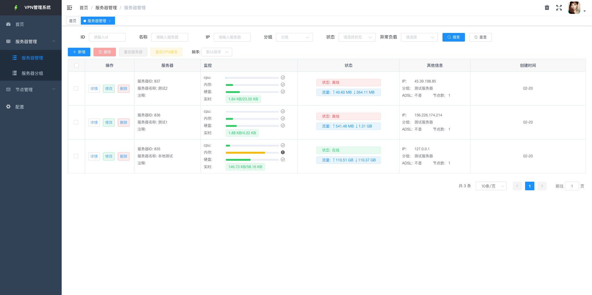
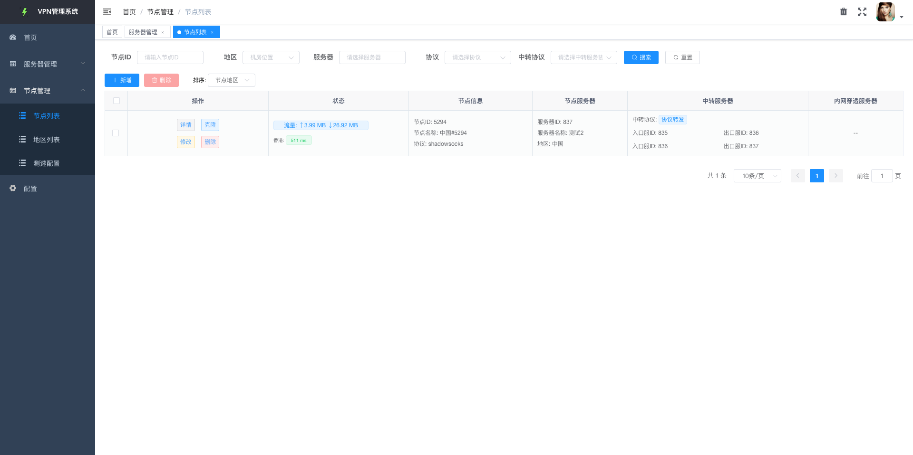
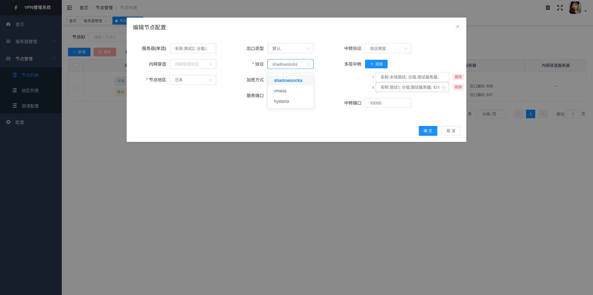
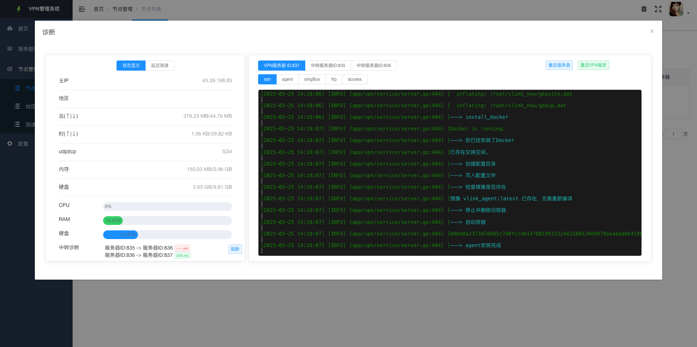

# 🚀 Nodami - 自建VPN翻墙梯子节点，从未如此简单

**Nodami** 是一款开源代理服务端管理平台。它可以轻松实现自动部署、集中管理多个服务器节点，完美兼容 Shadowsocks / Vmess / Vless / Trojan / Hysteria  多种协议，专为简化自建梯子节点而设计，无需复杂命令，可视化操作实现，全程web后台操作即可自动完成节点部署、配置、伪装，彻底告别复杂脚本、被墙困扰。它适合所有人
---

## 💡 主要适用人群

- ✅ 想自建节点但完全不懂技术、不会写配置的小白用户
- ✅ 想管理多个节点，受不了每次都重复搭建配置的用户
- ✅ 觉得各种面板太复杂、太重、不想学太多的懒人用户
- ✅ 不想研究 Xray / Hysteria / TLS / Reality 参数的省心党
- ✅ 因为配置不当导致节点一直被墙、不知道问题出在哪的受害者
- ✅ 想给亲朋好友搭个干净稳定的梯子，不想花时间做教程的实用主义者
- ......
---
## 🌟 项目特性

- **全自动部署，无需动手**：只需填写服务器信息，系统将自动搭建代理节点，无需敲命令、无需懂代码，真正一键启用。
- **多协议支持，场景全覆盖**：完美支持 Shadowsocks、Vmess、Vless、Trojan 和 Hysteria，多种主流协议一站式集成。
- **伪装协议一键配置**：支持 WebSocket（ws）和 gRPC 伪装，无需手动配置复杂 JSON，安全又隐蔽，小白用户也能轻松上手。
- **多服务器集中管理**：支持批量添加和统一管理多个服务器，页面清晰，状态一目了然。
- **节点管理灵活高效**：可对接任意数量的节点，支持测速、分组、地区标签，管理体验流畅高效。
- **全程后台操作，极简体验**：所有功能均通过后台可视化操作完成，无需手动上传配置或编辑文件，高度封装，操作无门槛。

---

## 🛠️ 安装教程

### 环境准备
- Linux 服务器（推荐 Ubuntu）
- 确保放行端口 （18080和1883）

### 快速安装 一键安装
```bash
curl -fsSL https://raw.githubusercontent.com/YoyoCrafts/Nodami/refs/heads/nodami/docker/install.sh -o install.sh && sudo bash install.sh
```

---

## 🎯 在线 Demo 地址

体验 Nodami 强大的节点管理能力：[演示地址](http://154.12.52.156:18080/)

- **测试账号**: `admin`
- **测试密码**: `123456`

---

## 📸 项目截图

| 节点仪表盘 | 服务器管理页                                  | 节点管理页                                    |
|------------|-----------------------------------------|------------------------------------------|
|  |  |  |

| 节点配置                                     | 节点日志                                   |
|------------------------------------------|----------------------------------------|
|  |  |

---

## 📣 参与贡献

欢迎提交 Issue 和 Pull Request，帮助我们改进 Nodami 项目，让更多用户能够轻松搭建高质量的代理服务。

---

## 💬 交流群

加入 [Telegram 交流群 @nodami_ui](https://t.me/Nodami)，获取实时帮助并与社区交流。

---

## ❤️ 特别感谢

感谢以下开源项目为 Nodami 提供了技术支持和灵感：

- [MetaCubeX](https://github.com/MetaCubeX/mihomo)
- [SagerNet](https://github.com/SagerNet/sing-box)
- [g-fast](https://gitee.com/tiger1103/gfast)

---

感谢使用 Nodami！🎉

如有疑问或建议，请随时联系开发团队。
